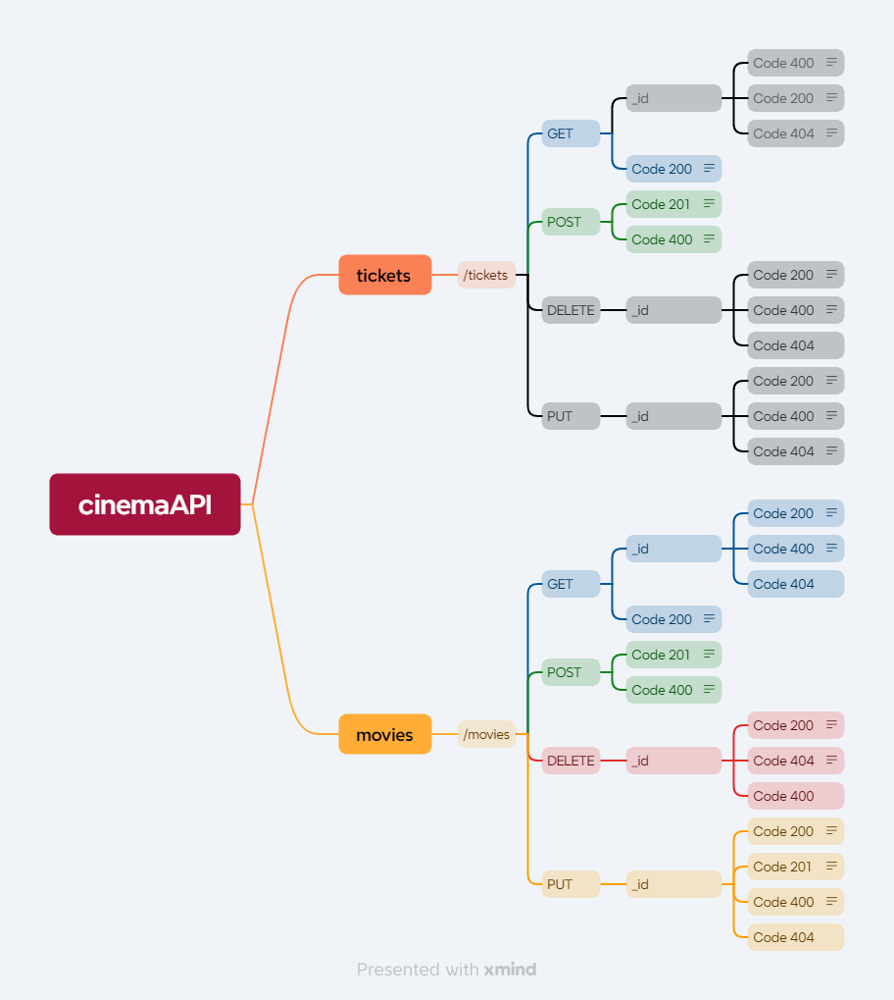
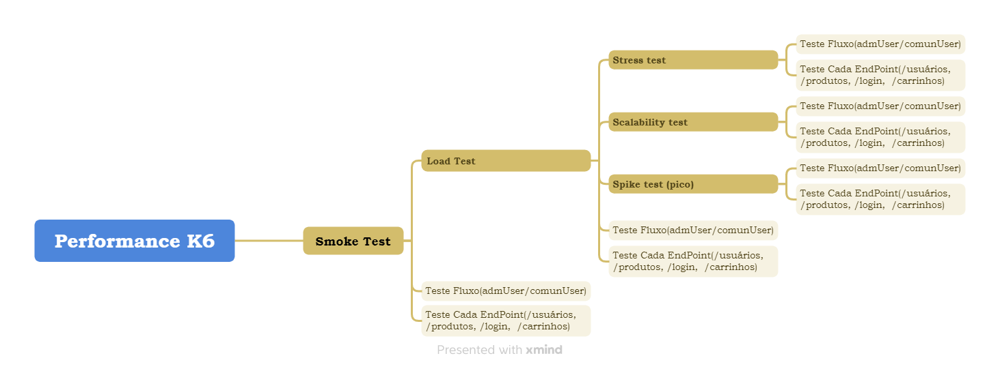

# Planejamento de teste
## 1.	Nome do projeto
Cinema API

## 2.	Resumo
Iniciou-se testes a uma API de Cinema onde por meio de sua própria documentação, podemos identificar seus critérios e 2 users story, por meio delas deveríamos criar testes de validação e relatar caso tenha algum bug na issues do gitlab. Para isso iremos fazer testes manuais no Postman e k6 para testes de performance.

### 2.1 Mapa mental
Para melhor entendimento foi criado também o mapa mental como forma de nortear a sequência tomada para produzir o planejamento que seria utilizado para a criação dos testes. 
#### Mapa mental da API e seus verbos:
 
#### Mapa mental dos testes feitos no k6:

## 3.	Pessoas envolvidas
Iarlon Soares da Silva Oliveira

## 4. Critérios de aceitação
### 4.1 Definition of Ready (DoR)
A Definition of Ready (DoR) assegura que todos os requisitos estejam claramente definidos e que estejam prontos para o desenvolvimento e testes. Para que um requisito seja considerado "pronto", ele deve atender aos seguintes critérios:

- Todos os requisitos funcionais e não funcionais estão documentados.
- Os casos de teste estão associados a cada requisito e foram revisados.
- As especificações e critérios de aceitação estão claros e compreensíveis.
- Os stakeholders foram consultados e as expectativas alinhadas.
- Não existem impedimentos conhecidos para iniciar os testes.

### 4.2 Definition of Done (DoD)
A Definition of Done (DoD) define quando uma tarefa de teste ou desenvolvimento é considerada completa. Para que um teste ou uma funcionalidade seja considerado "feito", ele deve atender aos seguintes critérios:

- Todos os casos de teste associados foram executados.
- Todos os bugs identificados foram documentados e, se possível, corrigidos.
- Os resultados dos testes foram documentados e compartilhados com os stakeholders.
- A documentação foi atualizada para refletir as alterações feitas.
- O código foi revisado e aprovado por um membro da equipe.

### 4.3 Movies

#### Requisitos Funcionais

- **RF001 - Criando um Novo Filme:**
  - O usuário administrador da API envia uma solicitação POST para o endpoint `/movies` com os detalhes do filme.
  - O sistema valida os campos obrigatórios e a unicidade do título.
  - Se as validações passarem, o sistema cria o filme e atribui um ID único.
  - O sistema retorna uma resposta de sucesso com o status 201 Created, incluindo o ID do filme.

- **RF002 - Obtendo a Lista de Filmes:**
  - O usuário envia uma solicitação GET para o endpoint `/movies`.
  - O sistema retorna uma lista de todos os filmes cadastrados com detalhes.

- **RF003 - Obtendo Detalhes de um Filme por ID:**
  - O usuário envia uma solicitação GET para o endpoint `/movies/{id}`, onde `{id}` é o ID do filme desejado.
  - O sistema verifica se o filme existe e retorna seus detalhes.
  - Caso o filme não exista, o sistema retorna um erro com o status 404 Not Found.

- **RF004 - Atualizando os Detalhes de um Filme por ID:**
  - O usuário administrador da API envia uma solicitação PUT para o endpoint `/movies/{id}`, onde `{id}` é o ID do filme a ser atualizado.
  - O sistema valida os dados e atualiza os detalhes do filme.
  - O sistema retorna uma resposta de sucesso com o status 200 OK e os detalhes atualizados.
  - Caso contrário, retorna status 400.

- **RF005 - Excluindo um Filme por ID:**
  - O sistema verifica a existência do filme e o remove permanentemente do banco de dados.
  - O sistema retorna uma resposta de sucesso com o status 200 OK.

#### Requisitos Não Funcionais

- **RNF001 - Desempenho da API rota movies:**
  - A API deve ser capaz de processar pelo menos 100 solicitações de criação de filmes por segundo.
  - O tempo médio de resposta para a criação de um novo filme não deve exceder 200 milissegundos.
  - A API deve ser capaz de responder a solicitações GET de listagem de filmes em menos de 100 milissegundos.
  - A lista de filmes deve ser paginada, com no máximo 20 filmes por página.
  - A API deve ser capaz de responder a solicitações GET de detalhes de um filme em menos de 50 milissegundos.
  - A API deve ser capaz de processar pelo menos 50 solicitações de atualização de filmes por segundo.
  - O tempo médio de resposta para a atualização dos detalhes de um filme não deve exceder 300 milissegundos.
  - A API deve ser capaz de processar pelo menos 30 solicitações de exclusão de filmes por segundo.
  - O tempo médio de resposta para a exclusão de um filme não deve exceder 400 milissegundos.

### 4.4 Tickets

#### Requisitos Funcionais

- **RF006 - Criando um Ticket:**
  - O usuário envia uma solicitação POST para o endpoint `/tickets`.
  - O sistema valida se todos os campos obrigatórios estão preenchidos corretamente.
  - O sistema verifica se o número do assento está entre 0 e 99.
  - O sistema verifica se o preço do ingresso está entre 0 e 60.
  - Se as validações passarem, o sistema cria uma reserva de ingresso com os detalhes fornecidos.
  - O sistema atribui um ID único à reserva de ingresso.
  - O sistema retorna uma resposta de sucesso com o status 201 Created, incluindo o ID da reserva.

- **RF007 - Obter lista de tickets:**
  - O usuário envia uma solicitação GET para o endpoint `/tickets`.
  - O sistema retorna uma lista de todos os tickets cadastrados com detalhes.

- **RF008 - Obtendo Detalhes de um Ticket por ID:**
  - O usuário envia uma solicitação GET para o endpoint `/tickets/{id}`, onde `{id}` é o ID do ticket desejado.
  - O sistema verifica se o ticket existe e retorna seus detalhes.
  - Caso o ticket não exista, o sistema retorna um erro com o status 404 Not Found.

- **RF009 - Atualizando os Detalhes de um Ticket por ID:**
  - O usuário administrador da API envia uma solicitação PUT para o endpoint `/tickets/{id}`, onde `{id}` é o ID do ticket a ser atualizado.
  - O sistema valida os dados e atualiza os detalhes do ticket.
  - O sistema retorna uma resposta de sucesso com o status 200 OK e os detalhes atualizados.
  - Caso contrário, retorna status 400.

- **RF010 - Excluindo um Ticket por ID:**
  - O sistema verifica a existência do ticket e o remove permanentemente do banco de dados.
  - O sistema retorna uma resposta de sucesso com o status 200 OK.

#### Requisitos Não Funcionais

- **RNF002 - Desempenho da API rota tickets:**
  - A API deve ser capaz de processar pelo menos 20 solicitações de reserva de ingressos por segundo.
  - O tempo médio de resposta para a reserva de um ingresso não deve exceder 300 milissegundos.
  - A API deve ser capaz de processar pelo menos 30 solicitações de exclusão de tickets por segundo.
  - O tempo médio de resposta para a exclusão de um ticket não deve exceder 400 milissegundos.
  - A API deve ser capaz de responder a solicitações GET de listagem de tickets em menos de 100 milissegundos.

- **RNF003 - Desempenho da API fluxo:**
  - A API deve ser capaz de processar pelo menos 20 solicitações de reserva de ingressos e criação de filmes por segundo.
  - O tempo médio de resposta para a não deve exceder 300 milissegundos.
  - A API deve ser capaz de processar pelo menos 30 solicitações de exclusão de tickets por segundo.

## 5.	Local dos testes
Os testes serão feitos na API: Cinema API. Utilizando da ferramenta Postman para realização desses testes funcionais e k6 para não funcionais.
## 6. Matriz de Rastreabilidade de Testes

### Requisitos Funcionais:

| Requisito ID | Cenários                            | Casos de Teste                                          | Prioridade | Status         |
|:------------:|:-----------------------------------:|:-------------------------------------------------------:|:---------:|:--------------:|
| RF001        | Criando um Novo Filme               | CT001 – Criar filme com descrição vazia            | Média      | Não Executado  |
| RF001        |                                     | CT002 – Criar filme com título repetido                 | Alta      | Não Executado  |
| RF001        |                                     | CT003 – Criar filme com `launchDate` no passado         | Alta    | Não Executado  |
| RF001        |                                     | CT004 – Criar filme com todos os campos corretos       | Média     | Não Executado  |
| RF001        |                                     | CT005 – Criar filme com `showTime` vazio                     | Alta     | Não Executado  |
| RF002        | Obter a lista de filmes             | CT006 – Listar filmes via `GET`                            | Baixa     | Não Executado  |
| RF003        | Obter detalhes de um filme por ID   | CT007 – Buscar filme com `id` inexistente| Média     | Não Executado  |
| RF003        |                                     | CT008 – Buscar filme com `id` recentemente excluído    | Média     | Não Executado  |
| RF003        |                                     | CT009 – Buscar filme com `id` de filme cadastrado        | Média      | Não Executado  |
| RF004        | Atualizando detalhes de um filme por ID | CT010 – Testar com `id` inexistente   | Alta      | Não Executado  |
| RF004        |                                     | CT011 – Atualizar título para um título já existente        | Alta      | Não Executado  |
| RF004        |                                     | CT012 – Atualizar filme com todos os campos corretos  | Média     | Não Executado  |
| RF005        | Excluindo um filme por ID           | CT013 – Excluir filme com `id` inexistente       | Baixa     | Não Executado  |
| RF005        |                                     | CT014 – Excluir filme com `id` de filme existente            | Média      | Não Executado  |
| RF005        |                                     | CT015 – Excluir filme com tickets cadastrados                | Alta      | Não Executado  |
| RF006        | Criando ticket para um filme  | CT016 – Teste utilizando `ID` de um filme inexistente| Alta      | Não Executado  |
| RF006        |                                   | CT017 – Teste utilizando `userID` repetido                        | Alta      | Não Executado  |
| RF006        |                                   | CT018 – Teste utilizando `showTime` no passado             | Média     | Não Executado  |
| RF006        |                     | CT019 – Teste com mais de um campo de validação inválido        | Média     | Não Executado  |
| RF006        |                                   | CT020 – Teste utilizando `seatNumber` e `price` inválidos  | Alta      | Não Executado  |
| RF006        |                                   | CT021 – Teste utilizando todos os campos válidos           | Alta      | Não Executado  |
| RF007        | Obter a lista de tickets          | CT022 – Listar tickets por meio do `GET`              | Baixa     | Não Executado  |
| RF008| Obter detalhes de um ticket por ID| CT023 – Buscar ticket com `id` inexistente         | Média     | Não Executado  |
| RF008        |                                   | CT024 – Buscar ticket com `id` recentemente excluído    | Média     | Não Executado  |
| RF008        |                                   | CT025 – Buscar ticket com `id` de ticket cadastrado        | Alta      | Não Executado  |
| RF009| Atualizando os detalhes de um ticket por ID | CT026 – Testar com `id` inexistente     | Alta      | Não Executado  |
| RF009        |                                   | CT027 – Atualizar título do ticket para um já existente    | Alta      | Não Executado  |
| RF009        |                                   | CT028 – Atualizar ticket com campos corretos e `id` válido | Média     | Não Executado  |
| RF010        | Excluindo um ticket por ID        | CT029 – Excluir ticket com `id` inexistente        | Média     | Não Executado  |
| RF010        |                                   | CT030 – Excluir ticket com `id` de ticket existente            | Alta      | Não Executado  |
| RF010        |                                   | CT031 – Excluir ticket com tickets cadastrados                 | Alta      | Não Executado  |
### Requisitos não Funcionais:

| Requisito ID | Cenários                            | Casos de Teste                                          | Prioridade | Status         |
|:------------:|:-----------------------------------:|:-------------------------------------------------------:|:---------:|:--------------:|
| RNF001     | Desempenho da API rota movies | CT032 - Criar filme                                         | Alta | Aprovado  |
| RNF001     |                                    | CT033 - Listar filmes                                                         | Alta      | Aprovado  |
| RNF001     |                                    | CT034 - Listar por meio do `id`                                         | Médio      | Aprovado  |
| RNF001     |                                    | CT035 - Atualizar filmes                                                    | Médio      | Aprovado  |
| RNF001     |                                    | CT036 - Exclusão de filme                                                 | Alta      | Aprovado  |
| RNF002     | Desempenho da API rota tickets | CT037 - Criar ticket                                         | Alta      | Aprovado  |
| RNF002     |                                    | CT038 - Listar ticket                                                          | Alta      | Aprovado  |
| RNF002     |                                    | CT039 - Listar ticket por `id`                                              | Baixa      | Não Executado  |
| RNF002     |                                    | CT040- Atualizar ticket                                                     | Alta      | Não Executado  |
| RNF002     |                                    | CT041 - Exclusão de ticket                                                | Alta      | Não Executado  |
| RNF003     | Desempenho da API fluxo - admUser  | CT042 - Smoke test admUser                                              | Alta      | Aprovado  |
| RNF003     |                                    | CT043 - Load test admUser                                                            | Alta      | Aprovado  |
| RNF003     |                                    | CT044 - Spike test admUser                                                            | Baixa      | Aprovado  |
| RNF003     |                                    | CT045- Stess test admUser                                                             | Alta      | Aprovado  |
| RNF003     |                                    | CT046 - Scalability test admUser                                                   | Alta      | Aprovado  |
| RNF003     | Desempenho da API fluxo - comunUser| CT047 - Smoke test comunUser                                                 | Alta      | Aprovado  |
| RNF003     |                                    | CT048 - Load test comunUser                                                            | Alta      | Aprovado  |
| RNF003     |                                    | CT049 - Spike test comunUser                                                             | Baixa      | Aprovado  |
| RNF003     |                                    | CT050- Stess test comunUser                                                             | Alta      | Aprovado  |
| RNF003     |                                    | CT051 - Scalability test comunUser                                                   | Alta      | Aprovado  |

### Legenda:
- **Requisito ID**: Referência ao requisito funcional do sistema.
- **Cenários**: Ação ou fluxo do sistema a ser testado.
- **Casos de Teste**: Detalhe específico do teste que será realizado.
- **Prioridade**: Indicação da importância do teste (Alta, Média, Baixa).
- **Status**: Situação atual da execução do teste (Não Executado, Em Andamento, Aprovado, Reprovado).

## 7.	Como os resultados dos testes serão divulgados
Irá ter print dos resultados obtidos no framework do K6 junto a suas métricas e threslholds: 
Cenário: Criando um Novo Filme; 
CT001 – Criar filme com descrição vazia 
Objetivo do teste: Deverá ser utilizado o POST de movies, inserindo dados válidos porém com descrição vazia. 
Resultado esperado: O usuário deverá receber um status 400 
Resultado obtido: O usuário recebe o status 400. 

### 7.1 Casos de teste
Casos de testes serão compartilhados em um arquivo separado, onde será explicado e junto com suas evidências.

## 8.   Testes candidatos à automação
Para garantir uma maior cobertura de cobertura, iria criar um fluxo de criação de filme onde o usuário com permissão iria criar um filme, iria pesquisar por meio do ID do filme, iria então criar diversos tickets para esse filme e buscar os tickets.

## 9.	Cronograma.
Período de início: 23/09/24 
Data de entrega: 04/10/24